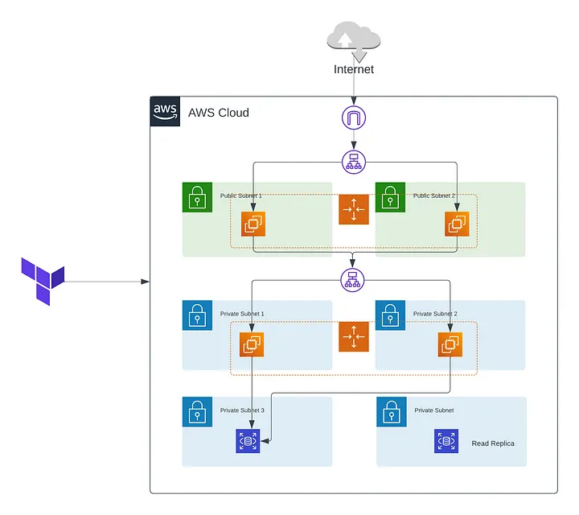

# Terraform
Deploying Multi-Tier Architecture on AWS using Terraform

## What is terraform
Terrafom is a infrastructure as a code tool that lets you define 
    define both cloud and on-prem resources in human readable configuration
    files that you can version, reuse and share 
    you can manage the lifeCycle of infra

## Multi_Tier Architecture 
IT typically consist of three layers.
1. Presentation Layer.(Web Server)
2. Application Layer.(App Server)
3. Database Server.(DB Server)

Each layer has it own purpose and can be scaled independently, by provideing flexibility and efficiency. 

## Getting Started.

install terraform 
configure aws cli 
configure aws <b>IAM</b> credentials

## Terraform 

<ul>
<li>Virtual Private Cloud</li>
<li>Subnet and Route Table</li>
<li>Security Group And N-ACL</li>
<li>Load-Balancer</li>
<li>Auto-Scaling Group</li>
<li>RDS DB-Instance</li>
</ul>

